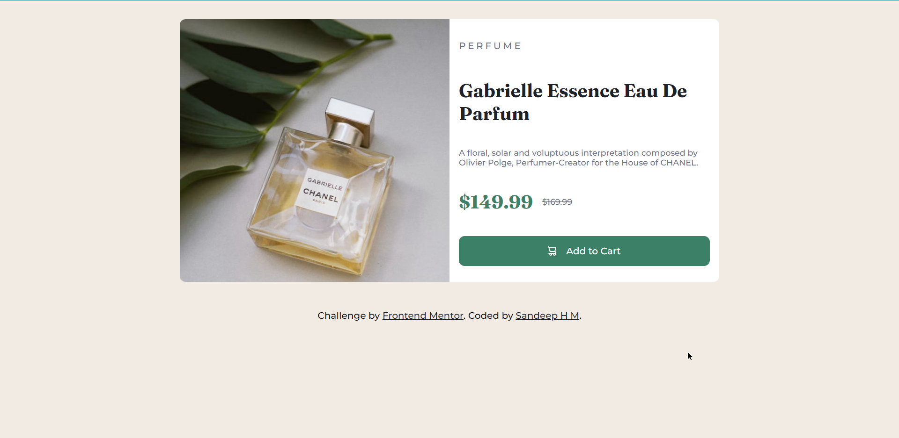

# Frontend Mentor - Product preview card component solution

This is a solution to the [Product preview card component challenge on Frontend Mentor](https://www.frontendmentor.io/challenges/product-preview-card-component-GO7UmttRfa).

## Table of contents

- [Overview](#overview)
  - [The challenge](#the-challenge)
  - [Screenshot](#screenshot)
  - [Links](#links)
- [My process](#my-process)
  - [Built with](#built-with)
  - [What I learned](#what-i-learned)
  - [Continued development](#continued-development)
  - [Useful resources](#useful-resources)
- [Author](#author)

## Overview

### The challenge

Users should be able to:

- View the optimal layout depending on their device's screen size
- See hover and focus states for interactive elements

### Screenshot

### Links

- Solution URL: [https://www.frontendmentor.io/solutions/product-preview-card-component-4fWhzBHQxY](https://www.frontendmentor.io/solutions/product-preview-card-component-4fWhzBHQxY)
- Live Site URL: [https://sandy5738.github.io/product-preview-card/](https://sandy5738.github.io/product-preview-card/)

## My process

### Built with

- Semantic HTML5 markup
- CSS custom properties
- Flexbox
- CSS Grid
- Mobile-first workflow

### What I learned

I started this project with mobile first approach and learnt about HTML roles along with CSS flexbox and CSS Grid.

### Continued development

In future projects, I would like to learn more about ARIA roles.

### Useful resources

- [MDN-ARIA](https://developer.mozilla.org/en-US/docs/Web/Accessibility/ARIA/Roles) - This helped me to get a detailed understanding of ARIA. I really liked this pattern and will use it going forward.

## Author

- Github - [Sandeep H M](https://www.your-site.com)
- Frontend Mentor - [@sandy5738](https://www.frontendmentor.io/profile/sandy5738)
